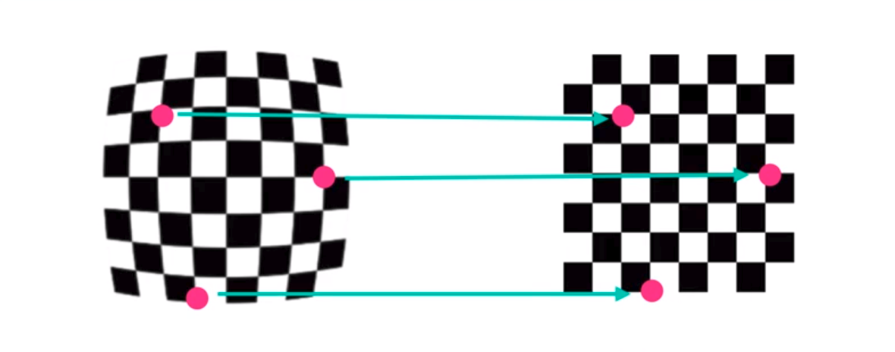
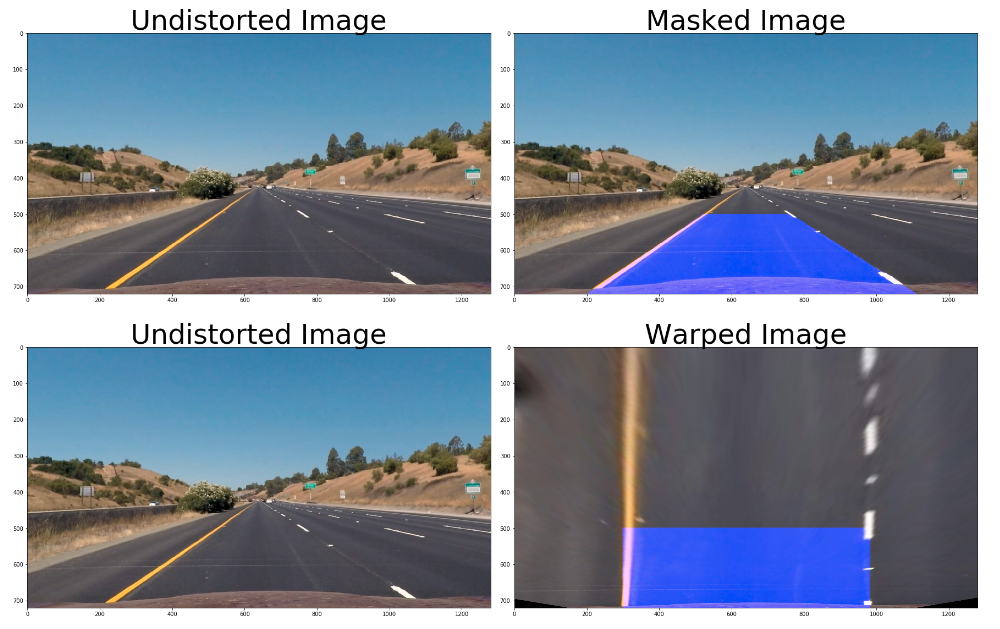
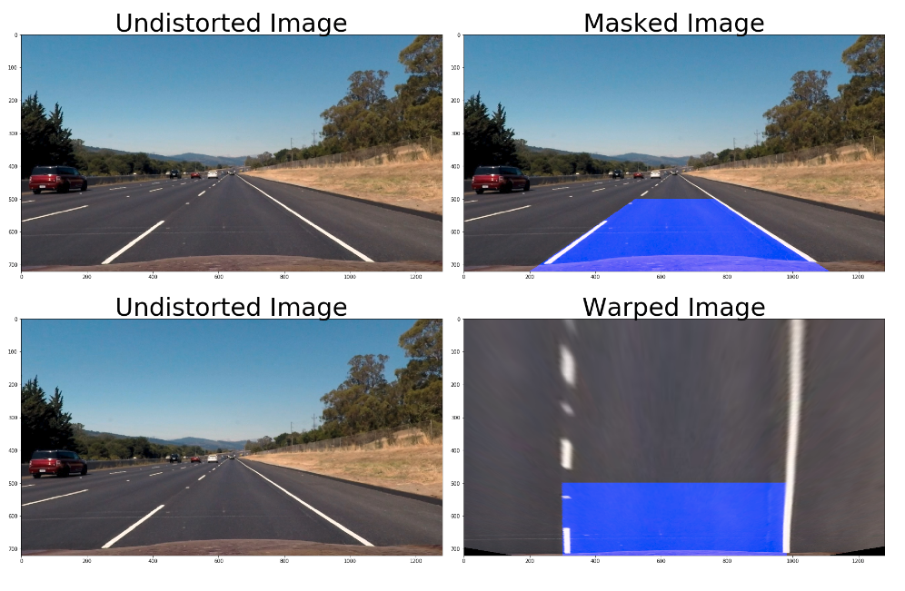
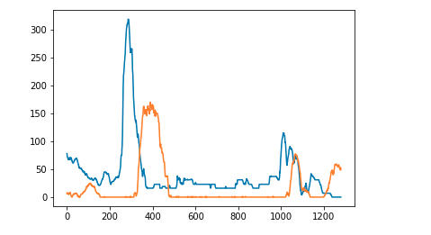

## Advanced Lane Finding
[](http://www.udacity.com/drive)


This project is to write a software pipeline that identify lane boundaries in a video. 


## The Project
---

The goals / steps of this project are the following:

1. Compute the camera calibration matrix and distortion coefficients given a set of chessboard images.
2.  Apply a distortion correction to raw images.
3.  Use color transforms, gradients, etc., to create a thresholded binary image.
4.  Apply a perspective transform to rectify binary image ("birds-eye view").
5.  Detect lane pixels and fit to find the lane boundary.
6.  Determine the curvature of the lane and vehicle position with respect to center.
7.  Warp the detected lane boundaries back onto the original image.
8. Output visual display of the lane boundaries and numerical estimation of lane curvature and vehicle position.

## Project Structure
* Images for camera calibration are stored in the folder called `camera_cal`. 
* Images in `test_images` are for testing  different steps on single frames.   
* Save examples images are located in `output_images`


## Goals
### 1. Compute the camera calibration matrix and distortion coefficients given a set of chessboard images.
The ultimate goal of this section is to measure some of the quantities that need to be known in order to control a car.
For example to steer a car, we need to measure how much a lane is curving. To do that we need to map out the lens in our
camera images, after transforming them to a different perspective. One way, is to look down on the road from above, a bird eye.
But, in order to get this perspective transformation right, we first have to correct for the effect of image distortion.
Camera doesnt create perfect images. Some of the objects in the images, especially ones near the edges, can get stretched
or skewed in various ways and we need to correct that.


#### Measuring Distortion
When we talk about image distortion, we're talking about what happens when a camera looks at 3D objects in the real world
and transforms them into a 2D image. So the first step in analysing camera images is to undo distortion so we can get
correct and useful information out of them.

So we know that distortion changes the size and  shapes of objects in an image, but how can we calibrate that? To do so
we can take pictures of known shapes, then we'll be able to detect and correct any distortion errors. Any shapes can be 
used to calibrate a camera but for this project a chessboard is used. A chessboard is great for calibration because its
regular high contrast pattern makes it easy to detect automatically and we know what an undistorted flat chessboard looks
like. Therefore multiple pictures of a chessboard against a flat surface is use to detect any distortion by looking at
the difference between the apparent size and the shape of the squares in these images, and the size and shape 
that they actually are. Then that information is used to calibrate our camera.

Create a transform that maps theses distorted points to undistorted points and finally, undistort any images.



#### Source Code for camera calibration
* A object points array is set to 8x6 grid.
* A loop trough calibration images using the `cv2.findChessboardCorners` is used to detect the chessboard corners in each
images. When the corners are found they get append to the object points array and image points array with the detected points
* With the list of object points and img points obtained we can use get the camera calibration matrix(mtx) and distortion
coefficients(dist)

###### Camera Calibration Source Code 
```python
def calculate_undistortion(img,nx,ny,objpoints, imgpoints):
    # Use cv2.calibrateCamera() and cv2.undistort()
    gray = cv2.cvtColor(img,cv2.COLOR_BGR2GRAY)
    #Search for corners in the grayscaled image
    ret, corners = cv2.findChessboardCorners(gray, (8,6), None)
    img = cv2.drawChessboardCorners(img, (8,6), corners, ret)
    ret, mtx, dist, rvecs, tvecs = cv2.calibrateCamera(objpoints, imgpoints, gray.shape[::-1], None, None)
    undist = cv2.undistort(img, mtx, dist, None, mtx)
    return undist, mtx, dist
    
images = ['../camera_cal/calibration1.jpg', '../camera_cal/calibration2.jpg']
for image in images:
    original_img = cv2.imread(image)
    undistorted_img, mtx, dist = calculate_undistortion(original_img,8,6,objpoints, imgpoints)
    display_image(original_img,undistorted_img,"Original Image","Undistorted Image")

```
### Camera Calibration Result


Camera Calibration Matrix is:
```sh
[[1.15396093e+03 0.00000000e+00 6.69705357e+02]
 [0.00000000e+00 1.14802496e+03 3.85656234e+02]
 [0.00000000e+00 0.00000000e+00 1.00000000e+00]]

```
Camera Distortion Coefficients is:
```sh
[[-2.41017956e-01 -5.30721173e-02 -1.15810355e-03 -1.28318856e-04
   2.67125290e-02]]
```


### 2.  Apply a distortion correction to raw images.
With the Camera Calibration Matrix and Camera Distortion Coefficients, we were able to undistort test images.

#### Test images Straight_line1

#### Test images Straight_line2

#### Test images test1

#### Test images test2

#### Test images test3

#### Test images test4


### 3.  Use color transforms, gradients, etc., to create a threshold binary image.

#### Canny Edge Detection
Canny edge detection is use  to find pixels that were like to be part of a line in  an image. Canny is great at finding
all possible lines in an image, but for lane dection, it gave us a lot of edges on scnery, and cars and other objects
that we ended up discarding.
 
 
 With lane finding, we know ahead of time that the lines we are looking for are close to 
vertical, to take advantage of that fact we can use gradients in a smarter way to detect steep edges that are more
likely to be lanes in the first place. With Canny, we can take a derivative with respect to X and Y in the process of
finding edges.

#### Sobel Operator
The Sobel operator is at the heart of the Canny Edge Detection algorithm. Applying it to an image is a way of taking
the derivative of the image in the x or y direction. If we apply the Sobel x and y operators to this the image below and
then we take the absolute value we get the result below
#### Test images test3

#### Absolute value of Sobel x and Sobel y


##### X vs Y
In the above images, we can see that the gradients taken in both the x and the y directions detect the lane lines
and pick up other edges. Taking the gradient in the x direction emphasizes edges closer to vertical.
Alternatively, taking the gradient in the y direction emphasizes edges closer to horizontal.
  
### Color and Gradient Threshold Source code
*  To apply Gradient Threshold, we converted the image to gray scale and apply the Sobel x funtion with minimum of 20 and
maximum of 100.
* To apply Color  Threshold we converted the image to HLS color space and then apply the threshold values of
minimum of 170 and maximum of 255/


```python
def apply_Sobel_x(gray):
    sobelx = cv2.Sobel(gray, cv2.CV_64F, 1, 0) # Take the derivative in x
    abs_sobelx = np.absolute(sobelx) # Absolute x derivative to accentuate lines away from horizontal
    scaled_sobel = np.uint8(255*abs_sobelx/np.max(abs_sobelx))
    return scaled_sobel
    
def apply_treshhold_gradient_on_x(scaled_sobel,tresh_min,tresh_max):
    sxbinary = np.zeros_like(scaled_sobel)
    sxbinary[(scaled_sobel >= tresh_min) & (scaled_sobel <= tresh_max)] = 1
    return sxbinary


test_img = cv2.imread('../test_images/test1.jpg')
undist = cv2.undistort(test_img, mtx, dist, None, mtx)
gray = cv2.cvtColor(undist,cv2.COLOR_BGR2GRAY)
hue_saturation_lightness = cv2.cvtColor(undist, cv2.COLOR_BGR2HLS) #HSL

scaled_sobel = apply_Sobel_x(gray)
sxbinary= apply_treshhold_gradient_on_x(scaled_sobel,20,100)
s_binary = apply_treshhold_color_channel(hue_saturation_lightness,80,255)

color_binary = np.dstack(( np.zeros_like(sxbinary), sxbinary, s_binary)) * 255
combined_binary = np.zeros_like(sxbinary)
combined_binary[(s_binary == 1) | (sxbinary == 1)] = 1

display_image_with_gray_cmap(convert_BRG_to_RGB(undist),combined_binary,'Undistorted Image','Threshold Image')

```
### Color and Gradient Threshold Result

 
### 4. Apply a perspective transform to rectify binary image ("birds-eye view").

To ge the bird's eye view of the lane we applied Perspective Transform to an image and used the cv2.getPerspectiveTransform()
to ge the Transform Parameter M.

4 Source points was pick in a trapezoidal shape(region masking) to represent a rectangle when looking down on the road 
from above. They represents the vertices of the lane.
```python
vertices = np.array([[(200,imshape[0]),(520, 500), (763, 500), (1110,imshape[0])]], dtype=np.int32)
```


#### Perspective Transform Source Code
```python
def mask_img(undistorted_img,ignore_mask_color,):
    mask = np.zeros_like(undist)
    imshape = undist.shape
    vertices = np.array([[(200,imshape[0]),(520, 500), (763, 500), (1110,imshape[0])]], dtype=np.int32)
    cv2.fillPoly(mask, vertices, ignore_mask_color)
    masked_img = cv2.bitwise_or(undist, mask)
    return masked_img


def warp_img(undist,masked_img):
    imshape = undist.shape
    vertices = np.array([[(200,imshape[0]),(520, 500), (763, 500), (1110,imshape[0])]], dtype=np.int32)
    warp_vertices = np.array([[(300,imshape[0]),(300, 500), (imshape[1]-300, 500), (imshape[1]-300,imshape[0])]], dtype=np.int32)
    M = cv2.getPerspectiveTransform(vertices.astype(np.float32), warp_vertices.astype(np.float32))
    warped_img = cv2.warpPerspective(masked_img, M, (imshape[1], imshape[0]), flags=cv2.INTER_LINEAR)
    return warped_img
    
test_images = ['../test_images/straight_lines1.jpg', '../test_images/straight_lines2.jpg']
for image in test_images:
    straight_line_img = cv2.imread(image)
    undist = cv2.undistort(straight_line_img, mtx, dist, None, mtx)
    masked_img = mask_img(undist,255)
    warped_img = warp_img(undist,masked_img)
    display_image(convert_BRG_to_RGB(undist),convert_BRG_to_RGB(masked_img),"Undistorted Image","Masked Image")
    display_image(convert_BRG_to_RGB(undist),convert_BRG_to_RGB(warped_img),"Undistorted Image","Warped Image")

```
### Perspective Transform Result
#### Test images Straight_line1

#### Test images Straight_line2


### 5. Detect lane pixels and fit to find the lane boundary.

#### Line Finding Histogram
After applying calibration,thresholding, and a perspective transform to a road image, we have a binary image where the
lane lines stand out clearly. However, we needed a way to explicitly decide  which pixels are part of the lines and which
belong to the left line and the right line.

Plotting a histogram of where the binary activations occurred across the image was one potential solution.
Below is a the historgram of brigh pixels along the x-axis for images test5.jpg(Blue) and test6.jpg(Orange)



#### Test 5 Image


#### Test 6 Image


#### Sliding Window Algorithm 
With this histogram we were able to add up the pixel values along each column in the image. In our thresholded binary
image, pixels are either 0 or 1, so the two most prominent peaks in the histogram will be good indicators of the x-position
of the base of the lane lines.  We used it as a starting point for where to search for the lines. From that point we used
the Sliding Window algorithm, placed around the line centers, to find and follow the lines up to the top of the frame.

The parameters used for the Sliding Window are:


